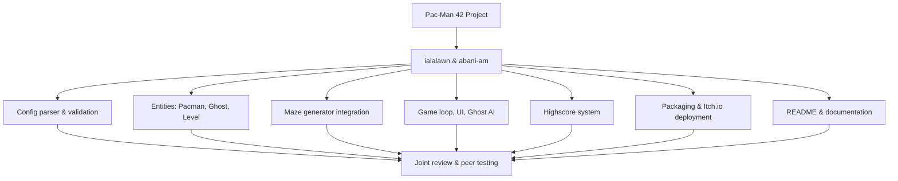

# Project Management

## Team Organization

The project was developed entirely through pair programming: both members worked together on every module, from architecture and entity design to implementation, packaging, and documentation. All decisions (e.g. entity design, Pydantic validation strategy, packaging approach) were made jointly through continuous discussion, and both members reviewed and tested every part of the codebase together.

## Risk Analysis

| Risk | Likelihood | Impact | Mitigation |
|---|---|---|---|
| External `mazegenerator` package fails or has an unstable API | Medium | High | Wrapped all calls in try/except; adapter layer isolates the rest of the codebase from the package's interface |
| Config file is manually edited/broken during defense | High | Medium | Defensive Pydantic validators clamp every field to safe defaults; no unhandled traceback possible |
| `pyinstaller`/`butler` packaging fails on submission day | Medium | High | Packaging tested early via `packaging/publish.sh`; kept as a repeatable one-command script |
| Ghost AI performance issues on larger mazes (levels 5–10) | Low | Medium | Chase logic kept lightweight (distance-based, no full pathfinding) to avoid frame drops |

## Acceptance Test Plan

| Feature | Test |
|---|---|
| Config loading | Missing file → safe defaults, no crash |
| Config loading | Invalid JSON → safe defaults, no crash |
| Config loading | `#`, `//`, `/* */` comments stripped correctly |
| Maze generation | `PERFECT=False` produces valid Pac-Man-style maze |
| Player movement | Pac-Man cannot pass through walls |
| Ghost behavior | Ghosts switch to edible state after Super Pac-Gum |
| Highscore | Top 10 persist correctly across restarts |
| Cheat mode | Invincibility / level skip work as expected |
| Packaging | `make build` + `publish.sh` produce a working Itch.io build |

## Blocking Points & Conflicts

- **Itch.io project naming mismatch** — initial `butler push` attempts failed with `invalid target (bad user)` due to a mismatch between the `USERNAME` in the publish script and the actual Itch.io account handle. Resolved by aligning the script's `USERNAME`/`GAME` values with the exact Itch.io project URL slug.
- **Poetry package-mode error** — `poetry install` initially failed with *"No file/folder found for package"* since the project is an application, not an importable library. Resolved by setting `package-mode = false` under `[tool.poetry]`.
- No unresolved team conflicts to date; working together on every task kept the team fully aligned throughout development.