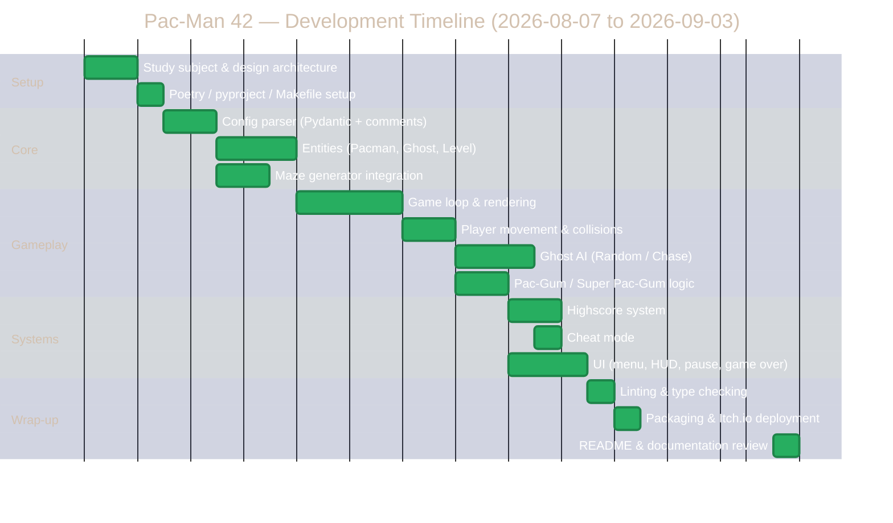

# Project Timeline

## Gantt Chart

## Progress Tracking

Total duration: **4 weeks**, from **Friday, August 7, 2026** to **Thursday, September 3, 2026** (deadline).

| Milestone | Planned |
|---|---|
| Architecture & config parser | Week 1 (Aug 7–13) |
| Core entities (Pacman/Ghost/Level) | Week 1–2 (Aug 11–18) |
| Maze generator integration | Week 1–2 (Aug 11–18) |
| Game loop & rendering | Week 2 (Aug 18–22) |
| Ghost AI & collisions | Week 3 (Aug 22–28) |
| Highscore + UI + Cheat mode | Week 3 (Aug 22–28) |
| Lint/type-check pass | Week 4 (Aug 28–Sep 2) |
| Packaging & deployment | Week 4 (Aug 28–Sep 2) |
| README & final review | Sep 2–3 |

*This table is updated as development progresses; deviations from the planned schedule are discussed in `management.md`.*