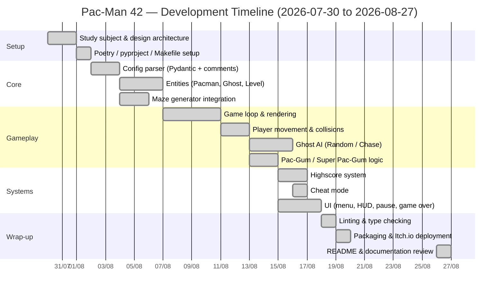

# Project Timeline

## Gantt Chart

## Progress Tracking

Total duration: **4 weeks**, from **Thursday, July 30, 2026** to **Thursday, August 27, 2026** (deadline).

| Milestone | Planned |
|---|---|
| Architecture & config parser | Week 1 (Jul 30–Aug 5) |
| Core entities (Pacman/Ghost/Level) | Week 1–2 (Aug 3–10) |
| Maze generator integration | Week 1–2 (Aug 3–10) |
| Game loop & rendering | Week 2 (Aug 10–14) |
| Ghost AI & collisions | Week 3 (Aug 14–20) |
| Highscore + UI + Cheat mode | Week 3 (Aug 14–20) |
| Lint/type-check pass | Week 4 (Aug 20–26) |
| Packaging & deployment | Week 4 (Aug 20–26) |
| README & final review | Aug 26–27 |

*This table is updated as development progresses; deviations from the planned schedule are discussed in `management.md`.*